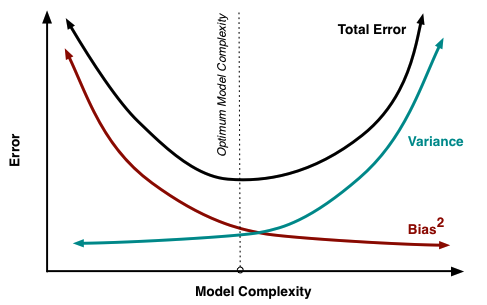

# Multiclass vs Multi-Label Classification

| Feature                | **Multiclass Classification** | **Multi-Label Classification** |
|------------------------|----------------------------|------------------------------|
| **Definition**         | Each instance belongs to **one and only one** class, making it mutually exclusive. | Each instance can belong to **multiple classes** simultaneously, allowing for overlapping categories. |
| **Number of Labels per Instance** | **Exactly one** label per instance, conforming to a single class constraint. | **One or more** labels per instance, supporting diverse categorical assignments. |
| **Example Use Case**   | **Handwritten digit recognition** (classifying a digit as 0–9), where each image is a single digit. | **Movie genre classification**, where a movie can be labeled as Action, Comedy, and Sci-Fi, reflecting its multifaceted nature. |
| **Output Format**      | Single class label per instance, such as `"Cat"`, representing a unique classification. | A list of multiple class labels per instance, such as `["Action", "Drama"]`, capturing all applicable categories. |
| **Model Output (Neural Networks)** | Uses **Softmax activation** to assign probabilities across classes, selecting the highest probability as the predicted class. | Utilizes **Sigmoid activation** to independently evaluate each class, assigning multiple labels based on a probability threshold. |
| **Loss Function**      | Employs **Categorical Cross-Entropy** to compare the predicted probability distribution with the true class for a single-label outcome. | Applies **Binary Cross-Entropy** for treating each class as an independent binary classification task, accommodating multiple labels. |
| **Algorithm Examples** | Includes One-vs-All (OvA), One-vs-One (OvO), Softmax-based classifiers, Decision Trees, SVM, and Naïve Bayes, catering to exclusive class assignments. | Features multi-label adaptations of Decision Trees, Random Forests, SVM, and Neural Networks with Sigmoid activation, designed for overlapping class scenarios. |
| **Evaluation Metrics** | Utilizes **Accuracy, Precision, Recall, F1-score, Log Loss** to assess performance on mutually exclusive class assignments. | Employs **Hamming Loss, Precision@K, Mean Average Precision, Micro/Macro F1-score, Jaccard Similarity** to evaluate performance when instances belong to multiple classes. |
| **Handling Ambiguity** | No ambiguity—model always selects a single class, ensuring clarity in classification. | Effectively handles ambiguous cases by allowing for multiple category assignments per instance. |
| **Real-World Example** | **Email spam classification** (Spam or Not Spam), where each email is categorized distinctly. | **Text tagging** for news articles, where an article can be tagged with multiple categories like "Politics", "Economy", and "World News", reflecting its comprehensive content. |

---

### **Bias-Variance Tradeoff in Machine Learning**  

The **bias-variance tradeoff** is a fundamental concept in machine learning that explains the balance between two types of errors that affect a model's performance:  

| **Aspect**   | **High Bias (Underfitting)** | **High Variance (Overfitting)** |
|-------------|-----------------------------|--------------------------------|
| **Definition** | Model is too simple and does not capture patterns well | Model is too complex and captures noise along with patterns |
| **Cause** | Model assumptions are too strong | Model is too flexible, capturing random fluctuations |
| **Symptoms** | - High training & test error   - Poor performance on both seen & unseen data | - Low training error but high test error   - Performs well on training data but poorly on new data |
| **Example** | Linear regression on a non-linear dataset | Deep neural network without regularization on small data |
| **Solution** | - Increase model complexity   - Add more features | - Use regularization (L1, L2, dropout)   - Collect more data   - Reduce model complexity |

---

### **Visualizing the Tradeoff**  
- **Low Bias, High Variance** → Model memorizes training data, performs poorly on new data.  
- **High Bias, Low Variance** → Model generalizes poorly, missing key patterns.  
- **Optimal Model** → Balances bias & variance for best generalization.  

---
